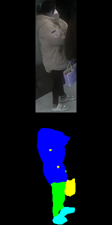
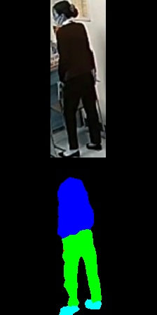
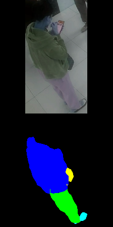

# STEGO
Original Code in [Here](https://github.com/mhamilton723/STEGO)

## 1.Prepare Dataset and Config
### Config
Change file train_config.yml depend on your choose. 
```
dataset_name: "directory"
dir_dataset_name: "dataset_name"
dir_dataset_n_classes: 5 # This is the number of object types to find
```
### Dataset 

```
dataset
|── images
|   |── unique_img_name_1.jpg
|   └── unique_img_name_2.jpg
└── labels
    |── unique_img_name_1.png
    └── unique_img_name_2.png
```
Don't have labeled dataset. Label folder will be empty.


## 2. Training
### Pre-compute KNNs
Change list dataset_names = ["directory"] and crop_types = ["five"]
Recommend using five instead of None.
```
python precompute_knns.py
```
### Training 
```
python train_segmentation.py
```
### Fine-tune
Add your path checkpoint to line 24 in file linear.py

Comment 'assert len(self.dataset) == self.nns.shape[0]' in line 548 file data.py
```
python linear.py
```
#### Tips: Only change Head Segmentation until loss can't decrease. Start training on all parameters of model.

## 3. Experiment
I trained with 70k images ( unlabeled 50k + labeled 19k ( manual label ~ 2k and LIP dataset 17k ))
Fine-tune with 2k my labled images. 

<p align="center">
  
  
  
    
</p>

#### You can check example in [Colab](STEGO.ipynb)

## 4.Deploy

### Onnx
```
python export_onnx.py
```
### Tensorrt
```
  /usr/src/tensorrt/bin/trtexec --onnx=STEGO.onnx \
                                --saveEngine=STEGO-fp16.trt \
                                --explicitBatch \
                                --minShapes=input:1x3x224x224 \
                                --optShapes=input:1x3x224x224 \
                                --maxShapes=input:1x3x224x224 \
                                --verbose \
                                --fp16 \
                                --device=0
```

Check deploy Tensorrt :
```
python infer_tensorrt.py
```

## 5.Distillation
```
git clone 'https://github.com/fregu856/deeplabv3.git'
```
Choose ResNer-34 for backbone of Student model
```
python distill_model.py
```


