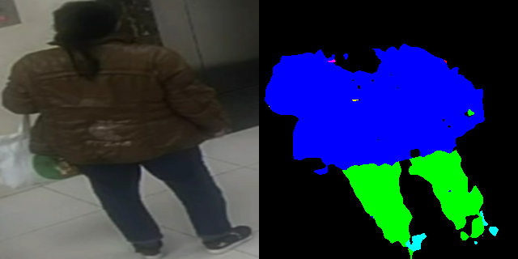
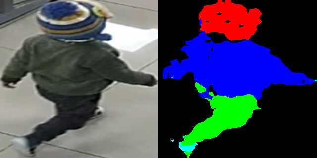
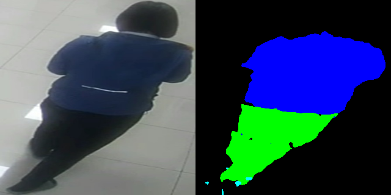
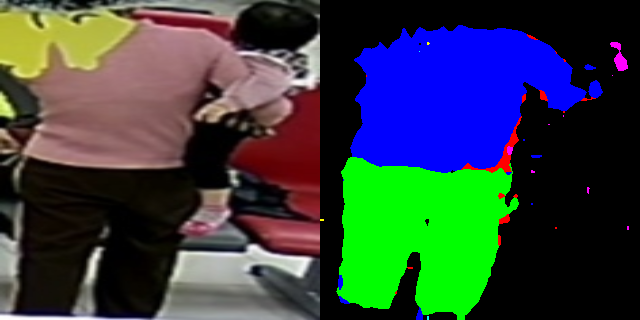

# STEGO
Original Code in [Here](https://github.com/mhamilton723/STEGO)

## 1.Prepare Dataset and Config
### Config
Change file train_config.yml depend on your choose. 
```
dataset_name: "directory"
dir_dataset_name: "dataset_name"
dir_dataset_n_classes: 5 # This is the number of object types to find
has_labels: False   (if you have labeled dataset, change it to True)
```
### Dataset 

```
dataset
|── images
|   |── unique_img_name_1.jpg
|   └── unique_img_name_2.jpg
└── label
    |── unique_img_name_1.png
    └── unique_img_name_2.png
```
Don't have labeled dataset. Label folder will be empty.


## 2. Training
### Pre-compute KNNs
```
python precompute_knns.py
```
### Training 
```
python train_segmentation.py
```
### Fine-tune
Now, I add some conv and classifier and training with labeled dataset.
Change use_label to True.
```
python linear.py
```

## 3. Experiment
I trained with 70k images ( unlabeled 50k + labeled 19k ( manual label ~ 2k and LIP dataset 17k ))
Fine-tune with 2k my labled images. 

<p align="center">
  
  
  
  
</p>
